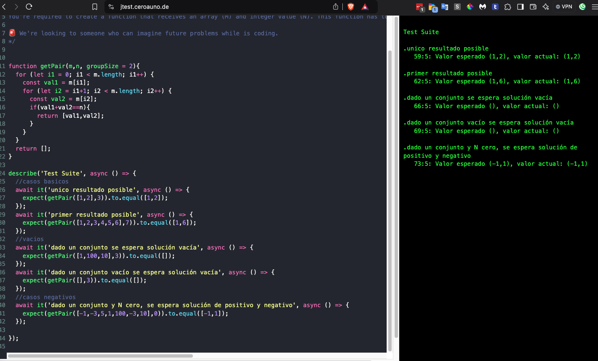

# Game 01

Let M be a not empty set of integer numbers, find the first subset of 2 numbers of M which sum N. For instance, let's say we've got a set of numbers [2, 5, 8, 14, 0] and N = 10, the resulting subset should be [2, 8].

## Challenge
You're required to create a function that receives an array (M) and integer value (N). This function has to return an array of the first possible solution.

> 🚨 We're looking to someone who can imagine future problems while is coding.

 # Solution

Se creó la función según el requerimiento. La función getPair() recorre el array buscando la primera combinación. Se añadió un parámetro por defecto groupSize = 2, en caso se requiera que sea un grupo de más de 2 elementos.

Usé un utilitario para poder realizar las pruebas. Lo utilicé para hacer scripts rápidos: https://jtest.ceroauno.de/ . Para pruebas más complejas, ver el ejercicio game02.

Se puede copiar el contenido de solution.js en la página y mostrar el resultado como en la captura.

Captura:

